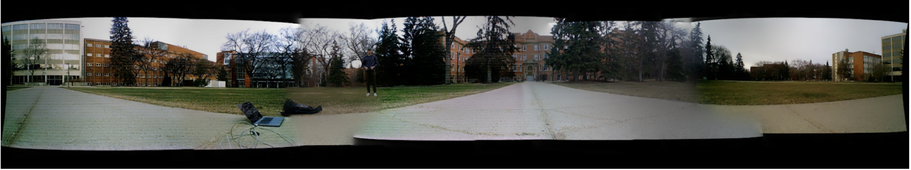
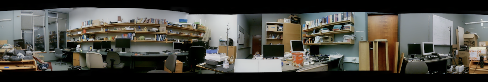

  <h1> Panoramic Image Stitching with a Cylindrical Camera Model </h1>
  
 This project explores the use of a cylindrical camera model for panoramic image stitching, with a focus on improving the geometric accuracy of the stitched images. 

  
  
<i> An example of the robot used for capturing images in the project. </i>

## Results

## Overview
In this project, we developed a pipeline that involves:

1. Data acquisition and calibration
2. Image stitching using a cylindrical camera model
3. Structure from Motion (SFM) in a non-conventional setting

Our approach aims to enhance the quality of stitched panoramic images by taking into account the real-world coordinates of specific points in the scene. We also explore different techniques for data acquisition and calibration to further improve the results.

## Usage
1. Capture images using the robot
2. Run the panoramic image stitching script

`python panoramic_image_stitching.py`

